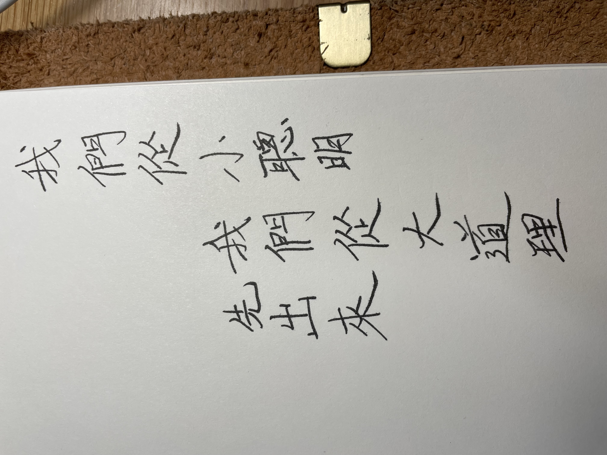

放棄我們的小技巧、小聰明，做個快樂的愚人，難得糊塗。

> 绝圣弃智 民利百倍

我們也是民 自然

> If we could renounce our sageness and discard our wisdom, If we could renounce our sageness and discard our wisdom,

於 二四年 愚人節

<iframe width="560" height="315" src="https://www.youtube.com/embed/0Rk099vYgDo?si=A9xdcaomo9A_iRzx" title="YouTube video player" frameborder="0" allow="accelerometer; autoplay; clipboard-write; encrypted-media; gyroscope; picture-in-picture; web-share" referrerpolicy="strict-origin-when-cross-origin" allowfullscreen></iframe>
